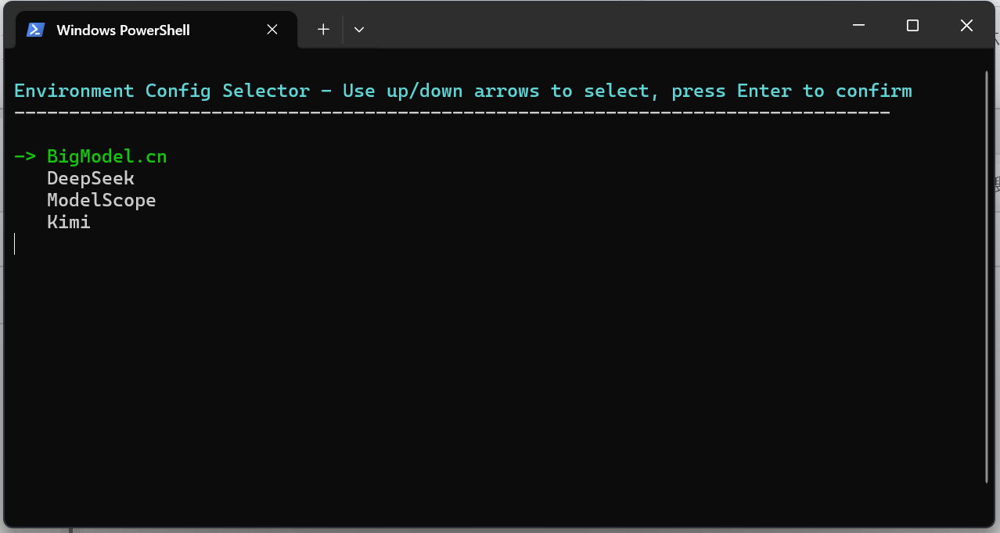
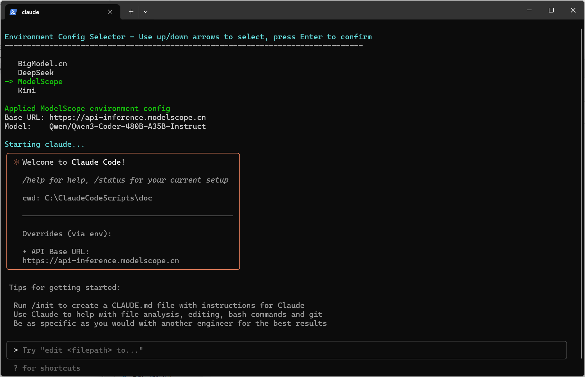

# Claude Code Environment Selector

一个用于在多个AI模型提供商之间切换环境的PowerShell工具，支持通过配置文件自定义提供商，还能设置便捷别名快速调用。

## 功能特性
- 🔀 在多个AI模型提供商之间快速切换
- 📝 通过JSON配置文件管理提供商设置
- 🎯 交互式命令行界面选择环境
- ⚙️ 自动设置环境变量并启动Claude
- 🆕 支持自定义提供商配置
- 🛠️ 设置PowerShell别名`cc`，一键启动工具

## 项目结构
```
ClaudeCodeScripts/
├── src/
│   └── Set-CCEnvironment.ps1    # 主要的PowerShell脚本
├── providers.json               # 提供商配置文件
├── README.md                    # 项目说明文档（当前文件）
└── LICENSE                      # 许可证文件
```

## 安装和使用
### 前提条件
- Windows PowerShell 5.1 或更高版本
- Claude Code已安装
- 至少一个AI模型提供商的API密钥（**需要官方支持Anthropic api**）

### 步骤1：下载本项目到本地路径
1. 克隆或下载本项目到本地任意路径，例如：在`C:`运行如下命令
```bash
git clone https://github.com/jingkarqi/Claude_Code_Environment_Selector.git
```
2. 确保`src\Set-CCEnvironment.ps1`和`providers.json`文件存在

### 步骤2：配置提供商
1. 编辑`providers.json`文件，添加你的API密钥和提供商信息：
```json
{
  "providers": {
    "BigModel.cn": {
      "base_url": "https://open.bigmodel.cn/api/anthropic",
      "auth_token": "your bigmodel.cn api key",
      "model": "glm-4.5",
      "small_fast_model": "glm-4.5-air",
      "default_opus_model": "glm-4.5",
      "default_sonnet_model": "glm-4.5",
      "default_haiku_model": "glm-4.5-air",
      "subagent_model": "glm-4.5-air"
    },
    "DeepSeek": {
      "base_url": "https://api.deepseek.com/anthropic",
      "auth_token": "your deepseek api key",
      "model": "deepseek-chat",
      "small_fast_model": "deepseek-chat",
      "default_opus_model": "deepseek-chat",
      "default_sonnet_model": "deepseek-chat",
      "default_haiku_model": "deepseek-chat",
      "subagent_model": "deepseek-chat"
    },
    "ModelScope": {
      "base_url": "https://api-inference.modelscope.cn",
      "auth_token": "your modelscope api key",
      "model": "Qwen/Qwen3-Coder-480B-A35B-Instruct",
      "small_fast_model": "Qwen/Qwen3-Coder-480B-A35B-Instruct",
      "default_opus_model": "Qwen/Qwen3-Coder-480B-A35B-Instruct",
      "default_sonnet_model": "Qwen/Qwen3-Coder-480B-A35B-Instruct",
      "default_haiku_model": "Qwen/Qwen3-Coder-480B-A35B-Instruct",
      "subagent_model": "Qwen/Qwen3-Coder-480B-A35B-Instruct"
    },
    "Kimi": {
      "base_url": "https://api.moonshot.cn/anthropic",
      "auth_token": "your moonshot api key",
      "model": "kimi-k2-turbo-preview",
      "small_fast_model": "kimi-k2-turbo-preview",
      "default_opus_model": "kimi-k2-turbo-preview",
      "default_sonnet_model": "kimi-k2-turbo-preview",
      "default_haiku_model": "kimi-k2-turbo-preview",
      "subagent_model": "kimi-k2-turbo-preview"
    }
  }
}
```
- 你可以添加任意数量的自定义提供商，只需在`providers`对象中新增配置项即可。
- 每个提供商配置项包含：
  - `base_url`：API基础URL
  - `auth_token`：认证令牌
  - `model`：主要模型名称
  - `small_fast_model`：小型快速模型名称（已弃用）
  - `default_opus_model`：用于Opus模型的模型名称
  - `default_sonnet_model`：用于Sonnet模型的模型名称
  - `default_haiku_model`：用于Haiku模型的模型名称（替换已弃用的`small_fast_model`）
  - `subagent_model`：用于子代理的模型名称

### 步骤3：配置别名
设置PowerShell别名`cc`，让你能在任意PowerShell窗口快速启动：
1. 打开PowerShell，执行以下命令检查并创建配置文件：
   ```powershell
   # 检查配置文件是否存在，不存在则创建
   if (-not (Test-Path $PROFILE)) {
       New-Item -ItemType File -Path $PROFILE -Force
   }
   # 打开配置文件编辑
   notepad $PROFILE
   ```
2. 在打开的记事本中添加以下内容（替换路径为你实际的脚本路径）：
   ```powershell
   # 定义cc别名，指向工具脚本
   function cc {
       & "C:\Claude_Code_Environment_Selector\src\Set-CCEnvironment.ps1"
   }
   ```
3. 保存并关闭记事本，执行以下命令使配置生效：
   ```powershell
   . $PROFILE
   ```

### 使用工具
直接在PowerShell中输入`cc`即可启动本工具：
```powershell
  cc
```

### 效果预览

#### 选择环境


#### 启动Claude Code


## 环境变量
脚本会自动设置以下环境变量（用于Claude Code连接自定义AI提供商）：
- `ANTHROPIC_BASE_URL`：提供商的API基础URL
- `ANTHROPIC_AUTH_TOKEN`：认证令牌
- `ANTHROPIC_MODEL`：主要模型名称
- `ANTHROPIC_SMALL_FAST_MODEL`：小型快速模型名称（已弃用）
- `ANTHROPIC_DEFAULT_OPUS_MODEL`：用于Opus模型的模型名称
- `ANTHROPIC_DEFAULT_SONNET_MODEL`：用于Sonnet模型的模型名称
- `ANTHROPIC_DEFAULT_HAIKU_MODEL`：用于Haiku模型的模型名称（替换已弃用的`ANTHROPIC_SMALL_FAST_MODEL`）
- `CLAUDE_CODE_SUBAGENT_MODEL`：用于子代理的模型名称

## 开发说明
### 脚本架构
- 使用PowerShell 5.1+ 编写，兼容Windows系统
- 从`providers.json`动态加载配置，支持灵活扩展
- 交互式命令行界面，新手也能轻松操作
- 支持UTF-8编码，中文显示无乱码

### 自定义修改
你可以根据需求调整脚本：
- 添加更多环境变量
- 修改界面样式（如颜色、提示语）
- 增加日志记录功能
- 集成其他开发工具

## 许可证
本项目采用 MIT 许可证 - 详见 [LICENSE](LICENSE) 文件。

## 贡献
欢迎提交Issue或Pull Request改进项目！

## 免责声明
本工具仅用于合法开发和测试。请确保你有权使用配置的AI服务，并遵守提供商的服务条款。
        
